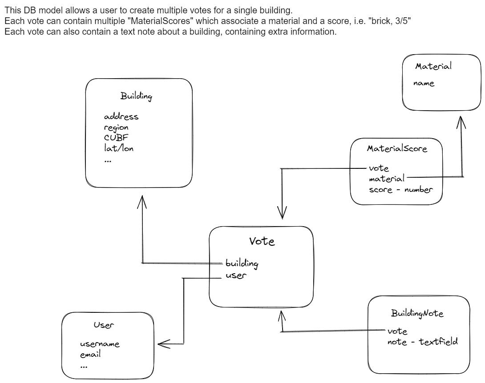

# ReCONstruct building identification tool

The goal of this tool is to provide a convenient way for users to rate the retrofit potential of buildings.
bubu

We first geocode addresses, then provide a live streetview of them. A first version had users determine the facade materials of buildings, with a 1-5 certainty rating, and could add new materials and add a note about the building, containing additional information.

The latest version focuses on identifying pre-fabricated metal buildings. The set of conditions will then be extended in a future version to further refine the selection.  


## Installation


### 0. Google Maps API key

This project makes use of the google maps API. To run it locally, you will need to obtain an authorization key.
Ask us for one from ReCONstruct, or set up your own by following the instructions [here](https://developers.google.com/maps/documentation/javascript/cloud-setup). (You will need to input a credit card, but local development and testing should come out at less than $5-10).

Once you have a key, set the `GOOGLE_MAPS_API_KEY` variable to it in the file `config/settings.py`.

### 1. (Optional) Create a virtual environment for the project
Virtual environments (venv for short) hold all dependencies for your project, and allow avoiding package version conflicts at the system level.
Each project has its specific dependency package versions installed in its virtual environment. 
This comes at the cost of disk space to store potential duplicate packages, for porject who would use the same ones. 
```
python -m venv .venv        # Will create the virtual environment in the '.venv' folder
.venv\Scripts\activate      # On Windows
source .venv/bin/activate   # On Linux/Mac
```

### 2. Install dependencies
```
pip install -r requirements.txt
```

### 3. Create the database
This project uses the [Django](https://www.djangoproject.com/) web framework. When using django, commands go through the `manage.py` script.

```
python manage.py migrate       # Will create a db.sqlite3 file in the root directory
```

### 4. Fill the database with buildings

The newly created database does not contain any buildings to classify yet, so we need to add some.
`data/buildings.csv` contains a few of them to get you started. 

These buildings have addresses, which must be converted to latitude/longitude coordinates in order to be used by the tool. This conversion process is called [geocoding](https://developers.google.com/maps/documentation/javascript/geocoding).

Run the following to geocode `n` buildings - each building will incur a call to the Google Maps Geocoding API, and thus incur a cost ($0.005 USD per request).
```
python manage.py geocode -n <n>
```
`geocode` is implemented as a Django management command, and is defined in `buildings/management/commands/geocode.py`.

Note: we attempt to detect duplicate buildings when geocoding the next time. You might still end up with duplicates in the DB.
If that's the case, you can run the following command to get rid of them. 
```
python manage.py dedup_buildings       # this command will identify duplicates, running again with option '-d' will actually delete them
```

### 5. Start the local server

The final step is to run the development server. This will make the application run at `http://127.0.0.1:8000/`.
Note that every access to the "Classify" section of the app will incur a Google Maps Javascript API call for a dynamic streetview and will thus incur a cost ($0.014 USD).

```
python manage.py runserver
```


## Database Model



Arrows indicate a foreign key relationship.


## Learning resources

To understand the codebase, see the links in `extras/learning_resources.txt`.
