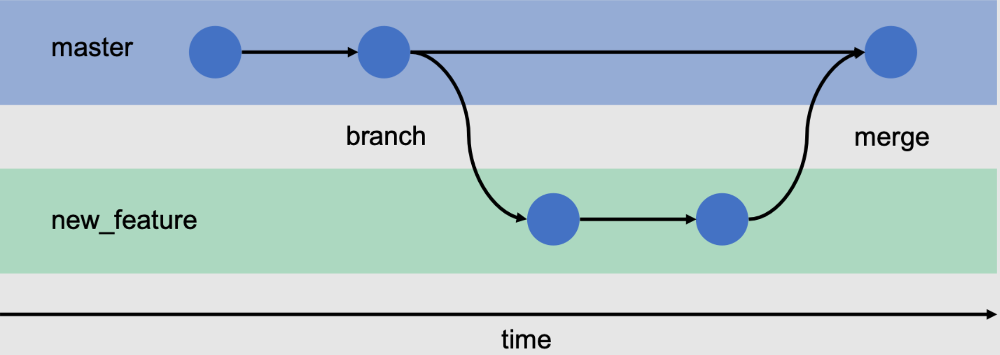

# BIT Contributing

This is a version of BIT with a SQLite copy of the production database in date of 2023 Aug 30th.
It allows quickly spinning up a local version, without having to install PostgreSQL etc.
## Prerequisites:
- Create a GitHub account: https://github.com/signup
- Create SSH keys
- Download and install git, a ‘source code management’ tool, or ‘version control system’ that will allow you to pull/push from github repositories: https://git-scm.com/
- Download and install VSCode: https://code.visualstudio.com/

## Setup SSH keys
SSH (Secure SHell) allows you to securely connect to remote computers. GitHub uses it to authenticate you when accessing repositories.
```bash
# Create a new SSH key pair 
ssh-keygen -t ed25519

# Print out your public key
cat ~/.ssh/id_ed25519.pub
# output looks like:
# ssh-ed25519 AAAAC3NzaC1lZDI1NTE5BBBAIOok5Fx9hQluIfIu9dfgx9RNDq3l55VQHiSASvltNIU user@host
```
Add the public key contents to your GitHub account by following these instructions:
https://docs.github.com/en/authentication/connecting-to-github-with-ssh/adding-a-new-ssh-key-to-your-github-account

## Cloning a repository
GitHub hosts code repositories (or 'repos' for short). They contain the official version of a software's code. 

<!-- Public repositories is what open-source software is all about and allow you to read and modify the code freely. Of course, that doesn't mean you can modify the official version, but you can 'fork' your own independent version, on which you have full control, and submit 'pull requests' (which should be called merge requests) that, if approved by maintainers, will be merged in the repository. -->

To work on code, you `clone` the repository locally (on your 'local machine'), modify/extend the code with your work, `commit` your changes locally, and finally `push` them 'upstream' back to the repo. There is a local and remote version of the repository that are kept in sync through pushes and pulls.

A repository usually has `branches`, which are independent copies of the code. There is usually a `main` (or `master` , though that term was cancelled) branch which represents the 'official' version of the code, and various feature branches, with work in progress.

Contributors make a new branch and work on it. After finishing local work, you `push` your changes to the `remote` branch in order to save them. Changes are eventually `merged` into the `main` branch.


*Diagram showing the a repository branching off and merging again*

To clone the repository locally, run

```bash
git clone -b sqlite-db git@github.com:ReCONstruct-Digital-Platform/Building-Identification-Tool.git 
```

Here we asked git to only copy this branch with the `-b sqlite-db` argument.

This will create a new directory called `Building-Identification-Tool/` containing the BIT codebase on your machine.


## Running BIT locally
The first time you run BIT, run the following:
```bash
# Create a new python virtual environment that will contain all dependencies
python -m venv .venv
# activate your new virtual environment, you'll see (.venv) appear to the left of your terminal prompt
source .venv/bin/activate

# Ask someone for a .env file with secrets

# Install project dependencies
pip install -r requirements.txt

# run a local server
python manage.py runserver
```
For subsequent times, you only have to run:
```bash
source .venv/bin/activate
python manage.py runserver
```

## Create a new branch that you'll work on

```bash
# Create a new branch and 'checkout' the branch (i.e. select it)
git branch your-branch-name
git checkout your-branch-name

# Can also do it in one command
git checkout -b your-branch-name
```

## Contributing to Infoboxes

### Background 
You will mainly be working with in `buildings\templates\buildings\surveys\survey_v1.html`. It is a Django template file that is used to render the survey for the user. Everything in `{{ }}` or `` tags is stuff that will be filled in by Django, while the rest is normal HTML code.

HTML defines the structure and (often) contents of the page. It's written using opening and closing tags like `<tag></tag>` that contain other tags or text. Together the tags form the 'Document Objet Model' (DOM) of the page, which is what you see if you look at a web page's source (`ctrl-u` in chrome) There are many different tags but the main ones you'll be using are `<h1></h1>` for header text (header 1 is the largest one, is goes to h6), `<div></div>` to define a new section, `<p></p>` to define a paragraph, and `` to insert images (notice no 'closing' tag for this one).

For a relatively short tutorial on HTML from THE reference for anything web see: https://developer.mozilla.org/en-US/docs/Learn/Getting_started_with_the_web/HTML_basics

Of course, you can also just ask me, especially if you have ideas of how your info box should look, which is often defined using another language called CSS (Cascading Style Sheets).


### Adding images

You can add any image you like to the Infobox content - even videos, GIFs etc.

To add an image, place the image file in the `buildings\static\images\survey_info` folder, in a subdirectory for the question you're working on, then add an `` tag in your content like so:

```html

```

Note that you can set the pixel width (or the height, or both) of the image in the tag.

### Collecting examples

This version of the DB has the same data as the real BIT version, you can use either to collect examples.
Keep track of the IDs when taking pictures.


