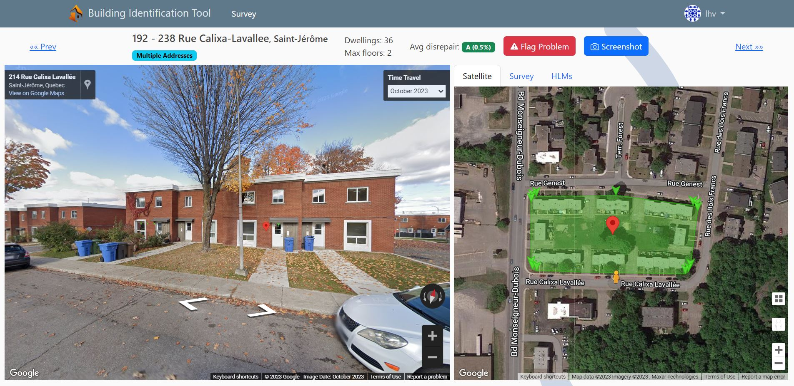

# ReCONstruct building identification tool

The goal of this tool is to provide a convenient interface for users to remotely survey buildings and evaluate their deep energy retrofit potential. Our data is currently only for buildings in Quebec, with a foucs on HLMs and prefabrivated metal buildings.



# Installation

## 0. (Optional) Create a virtual environment for the project
Virtual environments (venv for short) hold all dependencies for your project, and allow avoiding package version conflicts at the system level.
Each project has its specific dependency package versions installed in its virtual environment. 
This comes at the cost of disk space to store potential duplicate packages, for porject who would use the same ones.

```bash
python -m venv .venv        # Will create the virtual environment in the '.venv' folder
.venv\Scripts\activate      # On Windows
source .venv/bin/activate   # On Linux/Mac
```

## 1. Install dependencies and prepare environment
```bash
pip install -r requirements.txt
# The .env file will hold all your secret keys
cp .env.dist .env
```

## 2. Get API keys for services

This project makes use of the google maps and mapbox APIs. To run it locally, you will need to obtain authorization keys for to these services:
- [Google maps API](https://developers.google.com/maps/documentation/javascript/cloud-setup). You will need to input a credit card, but Google provides $200 USD in credits
- [Mapbox API](https://account.mapbox.com/auth/signup/). The free tier should be sufficient to start.

Additionally, we use a [Backblaze B2](https://www.backblaze.com/get-started) as a cloud object store. As it is S3 compatible, you can likely easily swap it for an [S3 bucket](https://aws.amazon.com/pm/serv-s3/) or a [MinIO](https://github.com/minio/minio/) instance locally. 

Once you have obtained all the above keys, fill in the following values in the `.env` file:

```conf
GOOGLE_MAPS_API_KEY=xxxx
GOOGLE_SIGNING_SECRET=xxxx
MAPBOX_TOKEN=xxxx

B2_KEYID_RW=xxxx
B2_APPKEY_RW=xxxx
B2_ENDPOINT=xxxx
B2_BUCKET_IMAGES=xxxx
```


## 3. Setup the Database

Download and install [PostgreSQL](https://www.postgresql.org/) as well as the [PostGIS extension](https://postgis.net/documentation/getting_started) used for geospatial work. 

Make sure `psql` and `shp2pgsql` are on your PATH. You should be able to use the `psql` command to connect to postgres like so:
```bash
psql -U postgres
```


Create a PostgreSQL DB and user, and activate the postgis extension.
```sql
CREATE USER bitdbuser WITH PASSWORD 'password';
ALTER ROLE bitdbuser SET client_encoding TO 'utf8';
ALTER ROLE bitdbuser SET default_transaction_isolation TO 'read committed';
ALTER ROLE bitdbuser SET timezone TO 'UTC';
CREATE DATABASE bitdb OWNER bitdbuser LC_COLLATE 'en_US.UTF-8' LC_CTYPE 'en_US.UTF-8' TEMPLATE 'template0';
GRANT ALL PRIVILEGES ON DATABASE bitdb TO bitdbuser;
GRANT ALL ON SCHEMA public TO bitdbuser;
ALTER USER bitdbuser SUPERUSER; --- Needed to create the test database and add extensions
\c bitdb -- Connects to the DB
CREATE EXTENSION postgis; -- activate the PostGIS extension for geographic calculations
CREATE EXTENSION pg_trgm; -- activate the extension for fuzzy string matching
``` 

You can rename the DB and user as your wish, however you must place those values in your local .env file, filling in the following fields:
Django will user these credentials to access the DB.
```conf
# DB connections settings
POSTGRES_NAME=bitdb
POSTGRES_USER=bitdbuser
POSTGRES_PW=password
POSTGRES_HOST=localhost 
POSTGRES_PORT=5432
``` 

Additionally, to support the django GIS extension, you will need to download some more utilies.
On Windows, download and install OSGeo4W. Follow the instructions and install in the default `C:\OsGeo4W` folder. You should get the necessary utilities.

Run the Django migrations, this will create all tables for our application in the DB.
```bash
python manage.py migrate
```

## 4: Fill up the database

The database setup pipelines consists of the following steps, each defined in a management command under `buildings.management.commands`:
- Import and process the roll XML files. These contain all the evaluation units in Quebec.
- Import and process the roll SHP files which gives us the lat/lng coordinates for each evaluation unit.
- Import and process the lot SHP. This gives us the polygon for each lot.
- Aggregate individually listed condos into single entries representing their building.
- Import the HLM dataset and map it to evaluation units.

The entire process takes around 6 hours or more and requires an internet connection.

```bash
python manage.py setup_database
```

You may run into some exceptions. If that's the case, you can comment out parts of the process in `setup_database.py` or the parts that haven't run in individual scripts.
For example, the full `parse_roll_xml` command sometimes throws an error after finishing parsing


### Alternatively, import test database

TODO


## 5. Start the server

The final step is to run the development server. This will make the application run at `http://127.0.0.1:8000/`.
Note that every access to the "Classify" section of the app will incur a Google Maps Javascript API call for a dynamic streetview and will thus incur a cost ($0.014 USD).

```bash
python manage.py runserver
```

You can create an admin user directly through the django shell.
```bash
python manage.py shell
```
```python
>>> from buildings.models import *
>>> u = User.objects.create_user("you-username", password="your-password")
>>> u.is_superuser = True
>>> u.is_staff = True
>>> u.save()
```


<br>
 

# Development

In addition to running the server, you will need to run tailwind.
```
# On windows, will have to run this
npm install -global cross-env

python manage.py tailwind install
python .\manage.py tailwind start

```
If you want to test the email functionality, run runmailer_pg. We are using `django-mailer`` for emails: https://pypi.org/project/django-mailer/1.2/
```
python .\manage.py runmailer_pg
```